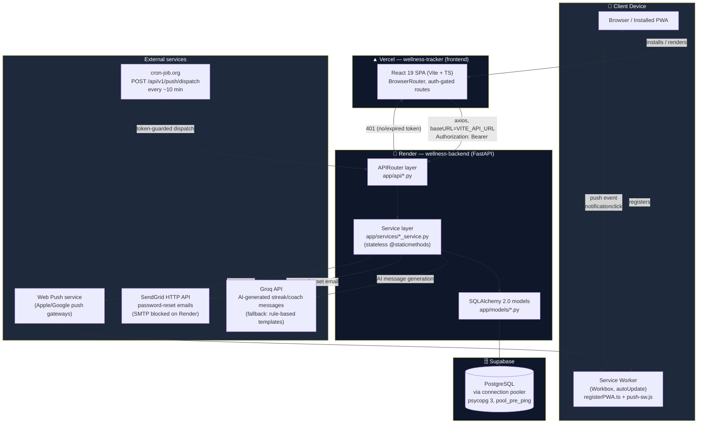
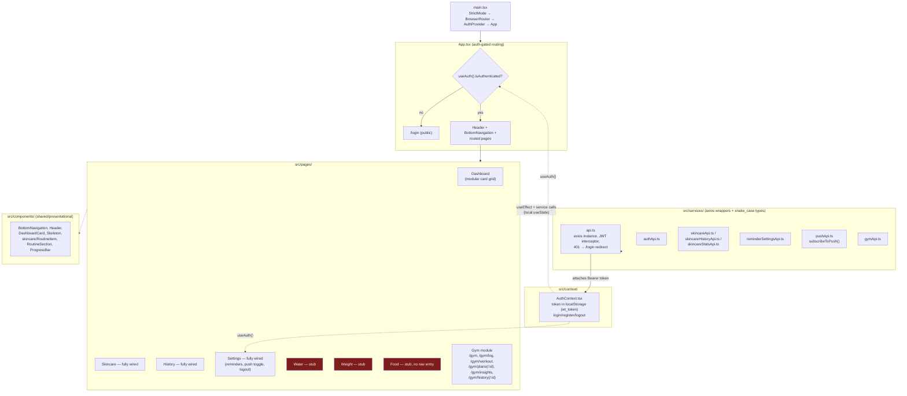
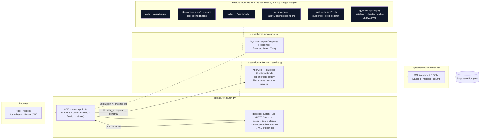
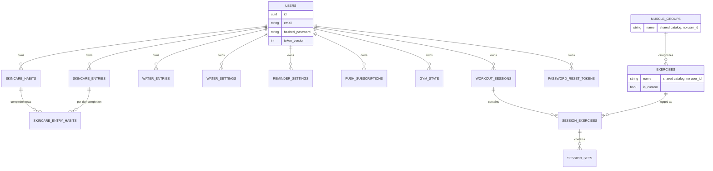

# Architecture

Full-stack view of `wellness-tracker` (this repo, the frontend) and `wellness-backend` (sibling repo). See each repo's `CLAUDE.md` for narrative detail — this doc is the diagram companion.

> Method/endpoint names below were pulled directly from source (`grep` over `app/api`, `app/services`, `src/services`), not from `CLAUDE.md`, which predates the `electricity`, `food`, and `feature-flags` modules.

## 0. Complete system diagram — every layer, every method

One graph: pages → frontend service functions → HTTP endpoints → backend service methods → models → database, per feature, plus the shared auth gate and external integrations. It's dense by design (that was the ask) — use your viewer's zoom/pan; `docs/architecture.md` sections 1–4 below give simplified, easier-to-read cuts of the same system.

```mermaid
graph TB
    CLIENT["📱 Browser / Installed PWA"]
    SW["Service Worker — push-sw.js<br/>push event / notificationclick"]

    subgraph SHELL["App shell (src/)"]
        ROUTER["App.tsx<br/>route table, isAuthenticated / hasFeature('electricity_tracker') gates"]
        AUTHCTX["AuthContext.tsx<br/>AuthProvider, useAuth()<br/>login() · register() · logout() · hasFeature() · persist()"]
        APICORE["api.ts<br/>axios instance · TOKEN_KEY='wt_token'<br/>request: attach Authorization Bearer<br/>response: 401 → redirect /login (except /auth/*)"]
    end

    CLIENT --> ROUTER
    ROUTER --> AUTHCTX
    AUTHCTX --> APICORE

    %% ===================== AUTH =====================
    subgraph AUTH["Auth"]
        AUTH_PAGE["Login.tsx · ForgotPassword.tsx<br/>ResetPassword.tsx · Settings.tsx (logout)"]
        AUTH_FE["authApi.ts<br/>register() · login() · getMe()<br/>updateMe() · forgotPassword() · resetPassword()"]
        AUTH_API["app/api/auth.py — prefix /api/v1/auth<br/>POST /register · POST /login<br/>POST /forgot-password · POST /reset-password<br/>GET /me · PATCH /me"]
        AUTH_SVC["AuthService (staticmethods)<br/>register() · authenticate()<br/>update_profile() · request_password_reset()<br/>reset_password()"]
        AUTH_EMAIL["email_service.py<br/>send_email() · send_password_reset_email()"]
        AUTH_MODEL[("users<br/>password_reset_tokens")]
    end
    AUTH_PAGE --> AUTH_FE --> AUTH_API --> AUTH_SVC --> AUTH_MODEL
    AUTH_SVC --> AUTH_EMAIL

    %% ============ SHARED AUTH GATE / SECURITY ============
    subgraph GATE["Shared: every protected endpoint"]
        SECURITY["security.py<br/>hash_password() · verify_password()<br/>create_access_token() · decode_token()<br/>decode_token_claims()"]
        DEPS["deps.py<br/>get_current_user()<br/>HTTPBearer → decode_token_claims<br/>compares JWT 'ver' vs users.token_version → 401 or user_id"]
    end
    AUTH_SVC -.uses.-> SECURITY
    DEPS -.uses.-> SECURITY
    DEPS -. "user_id: UUID = Depends(...)\non every route below" .-> SKIN_API & WATER_API & FOOD_API & GYM_API_CAT & GYM_API_WO & GYM_API_IN & ELEC_API & REM_API & FLAG_API

    %% ===================== SKINCARE =====================
    subgraph SKIN["Skincare"]
        SKIN_PAGE["Skincare.tsx"]
        SKIN_FE["skincareApi.ts: getToday() · updateToday()<br/>getHabits() · upsertHabits()<br/>skincareHistoryApi.ts: getHistory()<br/>skincareStatsApi.ts: getStats()"]
        SKIN_API["app/api/skincare.py — prefix /api/v1/skincare<br/>GET/PUT /today · GET/PUT /habits<br/>GET /history · GET /stats"]
        SKIN_SVC["SkincareService (staticmethods)<br/>get_today() · update_today()<br/>get_history() · get_stats()<br/>list_habits() · upsert_habits()"]
        SKIN_MODEL[("skincare_entries<br/>skincare_habits<br/>skincare_entry_habits")]
    end
    SKIN_PAGE --> SKIN_FE --> SKIN_API --> SKIN_SVC --> SKIN_MODEL

    %% ===================== WATER =====================
    subgraph WATER["Water"]
        WATER_PAGE["Water.tsx"]
        WATER_FE["waterApi.ts<br/>getWaterToday() · addWater()<br/>getWaterSettings() · updateWaterSettings()<br/>getWaterStats()"]
        WATER_API["app/api/water.py — prefix /api/v1/water<br/>GET /today · POST /today/add<br/>GET /history · GET/PUT /settings · GET /stats"]
        WATER_SVC["WaterService (staticmethods)<br/>get_today() · get_today_with_message()<br/>add_water() · get_history()<br/>get_settings() · update_settings() · get_stats()"]
        WATER_MODEL[("water_entries<br/>water_settings")]
    end
    WATER_PAGE --> WATER_FE --> WATER_API --> WATER_SVC --> WATER_MODEL

    %% ===================== FOOD =====================
    subgraph FOOD["Food"]
        FOOD_PAGE["Food.tsx"]
        FOOD_FE["foodApi.ts<br/>getToday() · createEntry()<br/>deleteEntry() · analyzePhoto()"]
        FOOD_API["app/api/food.py — prefix /api/v1/food<br/>POST '' · GET /today<br/>DELETE /{entry_id} · POST /analyze-photo"]
        FOOD_SVC["FoodService (staticmethods)<br/>create_entry() · get_today() · delete_entry()"]
        FOOD_VISION["food_vision_service.py<br/>analyze_photo(image_bytes)"]
        FOOD_MODEL[("food_entries")]
    end
    FOOD_PAGE --> FOOD_FE --> FOOD_API --> FOOD_SVC --> FOOD_MODEL
    FOOD_API -. "POST /analyze-photo" .-> FOOD_VISION

    %% ===================== GYM =====================
    subgraph GYM["Gym"]
        GYM_PAGE["GymHome.tsx · GymLog.tsx<br/>GymInsights.tsx · GymHistory.tsx · GymSessionDetail.tsx"]
        GYM_FE["gymApi.ts<br/>getExercises() · getMuscleGroups()<br/>createExercise() · updateExercise() · deleteExercise()<br/>getState() · updateState() · getNextCategory()<br/>quickLog() · getHistory() · getSession()<br/>getStats() · getVolume() · getRecords() · getRecovery()"]
        GYM_API_CAT["api/gym/catalog.py<br/>POST/GET/PUT/DELETE /exercises<br/>GET /exercises/{id} · GET /muscle-groups"]
        GYM_API_WO["api/gym/workouts.py<br/>GET/PUT /state · GET /log/next-category<br/>POST /sessions/quick-log<br/>GET /sessions · GET /sessions/{id}"]
        GYM_API_IN["api/gym/insights.py<br/>GET /insights/stats · /volume<br/>/records · /recovery"]
        GYM_SVC_CAT["CatalogService<br/>create_exercise() · list_exercises()<br/>get_exercise() · update_exercise()<br/>delete_exercise() · list_muscle_groups()"]
        GYM_SVC_WO["WorkoutService<br/>get_state() · update_state()<br/>get_next_log_category() · get_history()<br/>get_session() · quick_log()"]
        GYM_SVC_IN["InsightsService<br/>get_stats() · get_volume()<br/>get_records() · get_recovery()"]
        GYM_BUILD["builders.py<br/>build_session_detail()"]
        GYM_MODEL[("muscle_groups · exercises (shared, no user_id)<br/>gym_state<br/>workout_sessions → session_exercises → session_sets")]
    end
    GYM_PAGE --> GYM_FE
    GYM_FE --> GYM_API_CAT --> GYM_SVC_CAT --> GYM_MODEL
    GYM_FE --> GYM_API_WO --> GYM_SVC_WO --> GYM_MODEL
    GYM_FE --> GYM_API_IN --> GYM_SVC_IN --> GYM_MODEL
    GYM_SVC_WO -.-> GYM_BUILD

    %% ===================== ELECTRICITY (feature-flagged) =====================
    subgraph ELEC["Electricity (gated: hasFeature('electricity_tracker'))"]
        ELEC_PAGE["Electricity.tsx (renders slab_recommendation card)<br/>ElectricityLogReading.tsx · ElectricitySwitchMeter.tsx"]
        ELEC_FE["electricityApi.ts<br/>createMeter() · listMeters() · shareMeter()<br/>createReading() · listReadings()<br/>createSwitchEvent() · listSwitchEvents() · getInsights()"]
        ELEC_API["app/api/electricity.py — prefix /api/v1/electricity<br/>server-side gated: Depends(require_feature('electricity_tracker'))<br/>POST/GET /meters · POST /meters/{id}/share<br/>POST/GET /meters/{id}/readings<br/>POST/GET /switch-events · GET /insights (+ slab_recommendation)"]
        ELEC_SVC["ElectricityService<br/>create_meter() · list_meters() · share_meter()<br/>create_reading() · list_readings()<br/>create_switch_event() · list_switch_events()"]
        ELEC_INS["electricity_insights_service.py<br/>accessible_meter_ids() · shared_emails_by_meter()<br/>resolve_active_meter_id() · compute_cumulative()<br/>bracket_for() · get_insights()"]
        ELEC_SLAB["meter_slab_recommendation_service.py<br/>evaluate_switch_recommendation()<br/>— the ONE evaluator; read path and push dispatch both call it, no second algorithm"]
        ELEC_MODEL[("meters · meter_readings · switch_events<br/>meter_shares · slab_thresholds")]
    end
    ELEC_PAGE --> ELEC_FE --> ELEC_API --> ELEC_SVC --> ELEC_MODEL
    ELEC_API -. "GET /insights" .-> ELEC_INS --> ELEC_MODEL
    ELEC_INS -- "slab_recommendation" --> ELEC_SLAB --> ELEC_MODEL

    %% ===================== FEATURE FLAGS =====================
    subgraph FLAGS["Feature flags"]
        FLAG_FE["featureFlagsApi.ts<br/>getEnabledFeatures()"]
        FLAG_API["app/api/feature_flags.py<br/>prefix /api/v1/feature-flags<br/>GET ''"]
        FLAG_MODEL[("feature_flags")]
    end
    AUTHCTX -- "hasFeature() reads" --> FLAG_FE --> FLAG_API --> FLAG_MODEL
    FLAG_FE -. "gates nav/routes" .-> ELEC_PAGE

    %% ===================== REMINDERS + PUSH =====================
    subgraph NOTIFY["Reminders + Push"]
        REM_FE["reminderSettingsApi.ts<br/>getReminderSettings() · updateReminderSettings()"]
        REM_API["api/reminder_settings.py<br/>prefix /api/v1/settings/reminders<br/>GET '' · PUT ''"]
        REM_SVC["ReminderService<br/>get_settings() · update_settings()"]
        REM_MODEL[("reminder_settings")]

        PUSH_FE["pushApi.ts<br/>isPushSupported() · subscribeToPush()"]
        PUSH_API["api/push.py — prefix /api/v1/push<br/>POST /subscribe<br/>POST /dispatch?token=... (cron-guarded)"]
        PUSH_SVC["PushService<br/>save_subscription() · send_to_user()<br/>dispatch_due() · dispatch_water_due()<br/>dispatch_meter_slab_recommendation()"]
        PUSH_MODEL[("push_subscriptions<br/>reminder_dispatch_log")]
    end
    AUTH_PAGE -. "Settings.tsx" .-> REM_FE --> REM_API --> REM_SVC --> REM_MODEL
    AUTH_PAGE -. "Settings.tsx toggle (onChange, iOS gesture requirement)" .-> PUSH_FE --> PUSH_API --> PUSH_SVC --> PUSH_MODEL
    PUSH_SVC -- "dispatch_meter_slab_recommendation()\ncalls the SAME evaluator as the read path" --> ELEC_SLAB
    PUSH_SVC -. "per-candidate feature-flag check" .-> FLAG_MODEL

    %% ===================== SHARED AI MESSAGES =====================
    subgraph AI["Shared: ai_message_service.py"]
        AI_SVC["generate_message() — cache + fallback wrapper<br/>generate_streak_message()<br/>generate_gym_coach_message()<br/>generate_hydration_message()"]
    end
    SKIN_SVC -.-> AI_SVC
    WATER_SVC -.-> AI_SVC
    GYM_SVC_IN -.-> AI_SVC

    %% ===================== EXTERNAL =====================
    GROQ{{"Groq API<br/>(unset key → rule-based fallback text)"}}
    SENDGRID{{"SendGrid HTTP API<br/>(SMTP blocked on Render)"}}
    FOODAI{{"Food photo vision model"}}
    CRON{{"cron-job.org<br/>every ~10 min"}}
    WEBPUSH{{"Web Push gateway<br/>(Apple/Google)"}}

    AI_SVC --> GROQ
    AUTH_EMAIL --> SENDGRID
    FOOD_VISION --> FOODAI
    CRON --> PUSH_API
    PUSH_SVC -- pywebpush --> WEBPUSH --> SW --> CLIENT

    %% ===================== DATABASE =====================
    DB[("🗄️ Supabase PostgreSQL<br/>psycopg 3, connection pooler, pool_pre_ping")]
    AUTH_MODEL --> DB
    SKIN_MODEL --> DB
    WATER_MODEL --> DB
    FOOD_MODEL --> DB
    GYM_MODEL --> DB
    ELEC_MODEL --> DB
    FLAG_MODEL --> DB
    REM_MODEL --> DB
    PUSH_MODEL --> DB

    classDef page fill:#1e3a8a,color:#fff
    classDef fe fill:#0e7490,color:#fff
    classDef api fill:#6d28d9,color:#fff
    classDef be fill:#b45309,color:#fff
    classDef model fill:#166534,color:#fff
    classDef ext fill:#374151,color:#fff
    classDef shared fill:#4b5563,color:#fff
    class AUTH_PAGE,SKIN_PAGE,WATER_PAGE,FOOD_PAGE,GYM_PAGE,ELEC_PAGE page
    class AUTH_FE,SKIN_FE,WATER_FE,FOOD_FE,GYM_FE,ELEC_FE,FLAG_FE,REM_FE,PUSH_FE,APICORE,AUTHCTX,ROUTER fe
    class AUTH_API,SKIN_API,WATER_API,FOOD_API,GYM_API_CAT,GYM_API_WO,GYM_API_IN,ELEC_API,FLAG_API,REM_API,PUSH_API api
    class AUTH_SVC,SKIN_SVC,WATER_SVC,FOOD_SVC,GYM_SVC_CAT,GYM_SVC_WO,GYM_SVC_IN,GYM_BUILD,ELEC_SVC,ELEC_INS,ELEC_SLAB,REM_SVC,PUSH_SVC,AUTH_EMAIL,FOOD_VISION,AI_SVC be
    class AUTH_MODEL,SKIN_MODEL,WATER_MODEL,FOOD_MODEL,GYM_MODEL,ELEC_MODEL,FLAG_MODEL,REM_MODEL,PUSH_MODEL model
    class GROQ,SENDGRID,FOODAI,CRON,WEBPUSH,SW,CLIENT ext
    class SECURITY,DEPS shared
    class DB model
```

**Legend:** blue = page, teal = frontend service/shell, purple = backend endpoint, orange = backend service/business logic, green = model/table, gray = external system.

---

## 1. System overview

**Request path:** Browser/PWA → React SPA (Vercel) → axios (`src/services/api.ts`, JWT bearer, 60s timeout + cold-start retry) → FastAPI router → service layer → SQLAlchemy models → Supabase Postgres. A 401 anywhere bounces the SPA to `/login` (except on `/api/v1/auth/*`).

**Push path (backend-initiated, no HTTP request from the SPA):** cron-job.org hits `/api/v1/push/dispatch?token=...` every ~10 min → `PushService` checks due reminders per user → `pywebpush` → Apple/Google push gateway → the installed PWA's service worker (`push-sw.js`) shows the notification even if the app is closed.

---

## 2. Frontend — routing & layers (this repo)

Red = stub pages (bare heading only). Everything else is fully wired to the backend.

---

## 3. Backend — layered request flow (wellness-backend)

**Key backend conventions:** manual session handling (no `Depends(get_db)`), stateless service classes, get-or-create instead of 404s, one migration path (Alembic) for schema *changes* vs. `create_all` for fresh tables, and per-user data isolation via `user_id` FK + `get_current_user`'s `token_version` check (so a password reset invalidates all prior JWTs).

---

## 4. Data model — per-user vs. shared

`muscle_groups` and `exercises` are **shared master data** (no `user_id`) — every other table shown is per-user, scoped by a `user_id` FK and filtered on every query in the service layer.

---

## Deployment topology

| Piece | Host | Notes |
|---|---|---|
| Frontend SPA | Vercel | `vercel.json` rewrites all paths → `index.html` for client-side routing |
| Backend API | Render | Free tier spins down when idle → frontend has a 60s timeout + one-shot retry for cold starts |
| Database | Supabase (Postgres) | Accessed via connection pooler, `pool_pre_ping=True` |
| Push dispatch trigger | cron-job.org | External cron hits `/api/v1/push/dispatch?token=...` every ~10 min (Render has no built-in cron) |
| AI messages | Groq API | Optional — unset `GROQ_API_KEY` falls back to rule-based text, no functionality lost |
| Transactional email | SendGrid HTTP API | Password reset only; SMTP is blocked outbound on Render |
